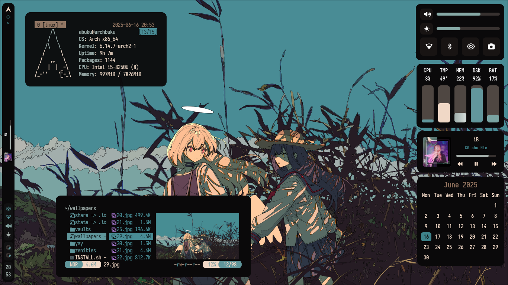
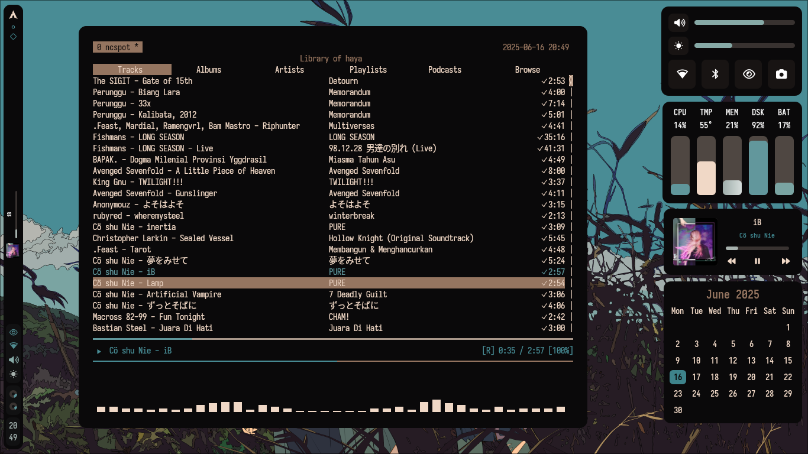
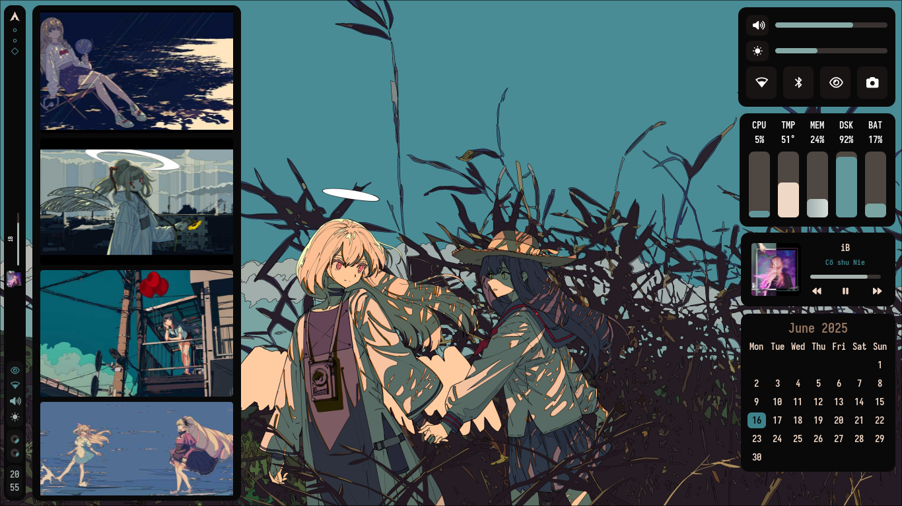

# 🌙 Luno Hyprland Setup — *Aesthetic Power for Luno OS*




Welcome to **Luno Hyprland**, a refined and performance-oriented rice for **Luno OS** users who value visual harmony and minimalist workflow efficiency.
While inspired by the original *Zenities Hyprland* setup, this configuration has been re-engineered and optimized for **Luno OS’s structure**, ensuring smooth integration with its pre-installed packages and system services.

If you’re passionate about design, modularity, and lightning-fast performance — this setup is for you.

---

## 🚀 Prerequisite Configuration

Before you begin, disable Hyprland’s automatic configuration generation to allow for full customization.

### Steps

1. Open your terminal.

2. Navigate to your Hyprland configuration folder:

   ```bash
   cd ~/.config/hypr/
   ```

3. Open `hyprland.conf` with your preferred text editor:

   ```bash
   nano hyprland.conf
   ```

4. Locate the following line:

   ```
   autogenerated=1
   ```

5. Disable autogeneration by either commenting it out or setting it to `0`:

   ```bash
   # autogenerated=1
   ```

6. Save and exit (`Ctrl+O`, `Enter`, then `Ctrl+X` in nano).

7. Apply changes:

   ```bash
   hyprctl reload
   ```

8. Restart Hyprland and confirm your custom configuration persists.

---

## 🧩 Installation (Luno OS Version)

### ⚠️ Requirements

This setup requires:

* **Luno OS (Upcoming soon...)**
* **Hyprland** window manager pre-installed
* Internet connection for package and asset fetching

### Steps

1. Ensure Git is installed:

   ```bash
   sudo luno install git
   ```

   *(Use `sudo pacman -S git` if `luno` command not found.)*

2. Clone the Luno Hyprland repository:

   ```bash
   cd ~
   git clone https://github.com/Hackb07/Luno-os
   ```

3. Enter the directory:

   ```bash
   cd Luno-os
   ```

4. Run the installer:

   ```bash
   sh INSTALL.sh
   ```

5. Once complete, reboot Hyprland:

   ```bash
   hyprctl reload
   ```

---

## ⚙️ Default Keybindings

### 🌐 Application Shortcuts

| Action               | Keybind                  | Description                        |
| -------------------- | ------------------------ | ---------------------------------- |
| Terminal (Tiled)     | `SUPER + RETURN`         | Launch terminal with `tmux`        |
| Terminal (Floating)  | `SUPER + SHIFT + RETURN` | Floating terminal instance         |
| File Manager (Yazi)  | `SUPER + M`              | Launch Yazi                        |
| File Manager (Float) | `SUPER + SHIFT + M`      | Floating Yazi window               |
| Web Browser          | `SUPER + B`              | Launch default browser             |
| Application Launcher | `SUPER + SPACE`          | Open Rofi-based launcher (`$menu`) |

---

### 🧰 System Utilities

| Action           | Keybind             | Description                            |
| ---------------- | ------------------- | -------------------------------------- |
| Reload Wallpaper | `SUPER + A`         | Reload Hyprpaper configuration         |
| Power Menu       | `SUPER + P`         | Open power options (lock, reboot, off) |
| Change Wallpaper | `SUPER + SHIFT + W` | Wallpaper selector script              |
| Widgets Panel    | `SUPER + H`         | Toggle Eww widgets                     |
| Reload Bar       | `SUPER + R`         | Reload Waybar configuration            |

---

### 🪟 Window Management

| Action          | Keybind     | Description                      |
| --------------- | ----------- | -------------------------------- |
| Close Window    | `SUPER + Q` | Kill active window               |
| Toggle Floating | `SUPER + V` | Switch floating/tiled mode       |
| Toggle Split    | `SUPER + J` | Vertical/Horizontal split toggle |
| Fullscreen      | `SUPER + F` | Toggle fullscreen                |

---

### 📌 Focus Navigation (`ALT + HJKL`)

| Direction | Keybind   |
| --------- | --------- |
| Left      | `ALT + h` |
| Right     | `ALT + l` |
| Up        | `ALT + k` |
| Down      | `ALT + j` |

---

### 🪟 Move Tiled Window (`ALT + SHIFT + HJKL`)

| Direction | Keybind           |
| --------- | ----------------- |
| Left      | `ALT + SHIFT + h` |
| Right     | `ALT + SHIFT + l` |
| Up        | `ALT + SHIFT + k` |
| Down      | `ALT + SHIFT + j` |

---

### 📏 Resize Tiled Window (`SUPER + ALT + HJKL`)

| Direction | Keybind           | Action       |
| --------- | ----------------- | ------------ |
| Shrink ←  | `SUPER + ALT + h` | Resize left  |
| Expand →  | `SUPER + ALT + l` | Resize right |
| Shrink ↑  | `SUPER + ALT + k` | Resize up    |
| Expand ↓  | `SUPER + ALT + j` | Resize down  |

---

### 🧲 Floating Window Movement (`SUPER + CTRL + HJKL`)

| Direction | Keybind            |
| --------- | ------------------ |
| Left      | `SUPER + CTRL + h` |
| Right     | `SUPER + CTRL + l` |
| Up        | `SUPER + CTRL + k` |
| Down      | `SUPER + CTRL + j` |

---

## 💡 Notes

* Default layout assumes **Colemak**, customize if needed.
* `SUPER` key usually maps to the **Windows key**.
* Designed with VIM-style **HJKL navigation** for efficiency.
* Modify `.config/hypr/hyprland.conf` to suit your workflow.

---

## 🧠 System Overview

| Component        | Application                                    |
| ---------------- | ---------------------------------------------- |
| **OS**           | [Luno OS](https://github.com/luno-os)          |
| **WM**           | [Hyprland](https://github.com/hyprwm/Hyprland) |
| **Terminal**     | [Kitty](https://github.com/kovidgoyal/kitty)   |
| **Shell**        | [zsh](https://github.com/zsh-users/zsh)        |
| **Music Player** | [ncspot](https://github.com/hrkfdn/ncspot)     |
| **Bar/Widgets**  | [eww](https://github.com/elkowar/eww)          |
| **Launcher**     | [Rofi](https://github.com/davatorium/rofi)     |
| **Editor**       | [Neovim](https://github.com/neovim/neovim)     |
| **File Manager** | [Yazi](https://github.com/sxyazi/yazi)         |

Color theming dynamically adapts via **Pywal**, generating cohesive palettes based on your wallpaper.

---

## 📸 Screenshots





---

## 🙌 Credits

* **[Rxyhn](https://github.com/rxyhn/tokyo)** — original aesthetic inspiration
* **[saimoomedits](https://github.com/saimoomedits/eww-widgets)** — eww widget templates
* **[Vimjoyer](https://www.youtube.com/@vimjoyer)** — workflow and ricing tutorials

---

## ⭐ Star History

[](https://www.star-history.com/#luno-os/luno-hyprland&Date)

---

# 🌓 Luno OS Hyprland Edition

> *Fast. Clean. Modular. Built for creators.*

---

